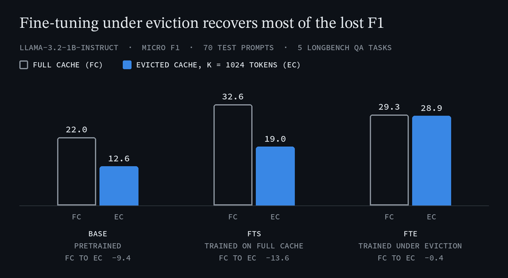

# evo-memory

Fine-tuning Llama-3.2-1B-Instruct with LoRA while a learned eviction policy, [NAMM](https://arxiv.org/abs/2410.13166), compresses the KV cache. The question: if a model will run with an evicted cache at inference, does it help to fine-tune it with eviction already switched on?

<p align="center">
  
</p>

<sub>Micro F1 on the 70-prompt test split of five LongBench QA sources. Hollow bars: full KV cache. Blue bars: NAMM-evicted cache, K = 1024 tokens.</sub>

## Result

Three model variants, each evaluated in two inference regimes:

| Label | Meaning |
|---|---|
| **Base** | pretrained Llama-3.2-1B-Instruct, no fine-tuning |
| **FTS** | LoRA fine-tuned with a full KV cache (standard fine-tuning) |
| **FTE** | LoRA fine-tuned with NAMM evicting tokens during every training step |
| **FC** | full KV cache at inference |
| **EC** | NAMM-evicted KV cache at inference, K = 1024 tokens |

- Evicting only at inference costs the standard fine-tune 13.6 F1 points (FTS: 32.6 to 19.0), more than fine-tuning gained over Base (10.6).
- Fine-tuning under eviction scores 28.9 in the same evicted setting, recovering about 73% of that drop. The price is 3.3 points when the full cache is available (FTE-FC 29.3 against FTS-FC 32.6).
- Metric: micro-averaged token-level F1 over the 70 held-out test prompts (Qasper and 2WikiMultihopQA from LongBench; Qasper, HotpotQA and 2WikiMultihopQA from LongBench-E; prompts of 4,096 to 6,500 tokens), greedy decoding. Values are from section 5 of [`experiment_specification.md`](experiment_specification.md).

## Team and attribution

A five-person team project for Statistical NLP at UCL (2026): **Mathis Weil**, **Shriram Ruppa Geethanath**, **Romain Hautier**, **Giacomo Maralla** and **Octavio Pappalardo**.

The write-up is [*Train as You Evict: Eviction-Aware Fine-Tuning for Compressed KV Cache Inference*](UCL_NLP_2026.pdf) (12 pages). It is the anonymous review build of the TACL template, which prints a confidential-submission header on every page.

This repository is a fork of [SakanaAI/evo-memory](https://github.com/SakanaAI/evo-memory), Sakana AI's code for NAMM, *An Evolved Universal Transformer Memory* (Cetin et al., ICLR 2025, [arXiv:2410.13166](https://arxiv.org/abs/2410.13166)). The memory policies, CMA-ES optimiser, evaluator and Hydra configuration come from that code. On top of it, the team ported NAMM to Llama-3.2-1B, switched eviction to a fixed top-K cache budget, fixed an attention-mask bug in the reference implementation, and added LoRA training under eviction plus the evaluation and analysis scripts.

## Setup

Requires Python 3.10+ and [uv](https://docs.astral.sh/uv/).

```bash
uv sync --extra gpu              # CUDA 12.1; use --extra cpu or --extra tpu instead
uv sync --extra gpu --extra dev  # adds ruff and pytest
```

`uv sync` creates `.venv/` from `uv.lock` and installs the project in editable mode. Activate it with `source .venv/bin/activate`, or prefix commands with `uv run`. On UCL GPU machines, home directories have strict quotas, so point the uv cache elsewhere before syncing (csh: `setenv UV_CACHE_DIR $QUOTA_DIR/uv_cache`).

Log in to Hugging Face (Llama 3.2 is gated) and Weights & Biases. GCS access (`gcloud auth application-default login`) is only needed for cloud syncing.

```bash
huggingface-cli login
wandb login
```

The code reads these environment variables from the shell (it does not load a `.env` file):

| Variable | Default | Purpose |
|---|---|---|
| `LLM_MODEL_PATH` | `meta-llama/Llama-3.2-1B-Instruct` | Hugging Face model ID or local path of the base model |
| `GCS_BUCKET`, `GCS_PROJECT` | `statistical-nlp` | GCS bucket and project for cloud syncing |

Key version pins (all dependencies are in `pyproject.toml`): `torch==2.3.1`, `transformers==4.41.2` (4.45+ breaks the `DynamicCache` API the custom Llama code relies on), `peft==0.11.1`, `numpy<2`.

## Reproducing the results

[`experiment_specification.md`](experiment_specification.md) is the full recipe: data filtering, hyperparameters, all six evaluation commands and the analysis scripts. In short, one NAMM run and two LoRA runs feed a grid of evaluations:

```bash
# 1. Train NAMM (CMA-ES, 200 generations)
python scripts/run/run_namm.py 'run@_global_=namm_bam_i1_llama32_1b_5t'

# 2. FTS: LoRA with a full cache (the YAML sets 100 epochs; the reported run used 150)
python scripts/run/run_lora.py --config scripts/configs/m1_lora_5t.yaml \
    --run_name fts --num_epochs 150

# 3. FTE: LoRA with NAMM evicting during training
python scripts/run/run_lora.py --config scripts/configs/m3_lora_frozen_namm_5t.yaml \
    --run_name fte --namm_checkpoint <namm.pt>

# 4a. EC regime: NAMM eviction at K = 1024 (omit --lora_checkpoint for Base)
python scripts/run/eval_namm_splits.py --run_config namm_bam_i1_llama32_1b_5t \
    --namm_checkpoint <namm.pt> --lora_checkpoint <best_ckpt.pt> \
    --cache_size 1024 --splits test

# 4b. FC regime, no eviction: --plain for Base; for FTS/FTE, no NAMM checkpoint
#     and a cache larger than any prompt
python scripts/run/eval_namm_splits.py --run_config namm_bam_i1_llama32_1b_5t \
    --plain --splits test
python scripts/run/eval_namm_splits.py --run_config namm_bam_i1_llama32_1b_5t \
    --lora_checkpoint <best_ckpt.pt> --cache_size 8192 --splits test
```

- Keep the `namm_bam_i1_llama32_1b_5t` preset for every evaluation: it sets the 4,096 to 6,500-token filter that defines the 70-prompt test split. The `full_cache_baseline_llama32_1b` preset has no lower bound, so its test split is different.
- `run_lora.py`, `run_es.py`, `run_joint.py` and `run_eval.py` take `--config <yaml>` for defaults, and CLI flags override it. `run_lora.py` and `run_es.py` sync to GCS by default; pass `--no-gcs` to turn this off.
- `--splits extended_test --filter_by_length 8192` evaluates the test prompts plus 154 longer ones (6,500 to 8,192 tokens), used only for out-of-distribution evaluation. Without `--filter_by_length 8192`, a word-count pre-filter drops some of the longer prompts.
- Config names keep the earlier M-scheme: `m1_lora_5t` is FTS and `m3_lora_frozen_namm_5t` is FTE.
- Joint NAMM + LoRA training (`run_joint.py`), ES fine-tuning (`run_es.py`, `es_finetuning/`) and the H2O, ScissorHands and recency baselines are exploratory and not part of the results above.

Data split (`split_seed=42`, stratified 70/15/15, prompts of 4,096 to 6,500 tokens):

| Task | Train | Val | Test |
|---|---|---|---|
| `lb/qasper` | 60 | 13 | 14 |
| `lb/2wikimqa` | 56 | 12 | 12 |
| `lb/qasper_e` | 77 | 16 | 18 |
| `lb/hotpotqa_e` | 51 | 10 | 12 |
| `lb/2wikimqa_e` | 62 | 13 | 14 |
| **Total** | **306** | **64** | **70** |

### NAMM training options

`run_namm.py` is a Hydra app. The run preset must be passed as `'run@_global_=<preset>'`; plain `run=` raises a Hydra error.

- **Eviction rule.** The default (`threshold_only=false`) evicts tokens scoring below 0 and then keeps at most the `cache_size` highest-scoring tokens, a hard budget at every step. `threshold_only=true scoring_initializer=2` drops the cap and only evicts tokens scoring below 0, as in the original NAMM paper; starting the scores at 2 stops CMA-ES from collapsing them all below zero and evicting everything. `scripts/analysis/check_eviction_stats.py --cache_size 0` reports token retention for a threshold-mode checkpoint.
- **Checkpoints.** `latest.pt` is saved every iteration; `save_checkpoint_every=N` saves it every N iterations instead. The best checkpoint, `ckpt.pt`, is only overwritten when `val_tasks_aggregate` improves. `scratch=false` resumes from `latest.pt`.
- **Buffer size vs data split.** `max_conditioning_length` sets the KV buffer size and `split_max_conditioning_length` sets which prompts enter the train/val/test split. Overriding only the first also shrinks the split and can empty it for long-context tasks, so set both (e.g. `max_conditioning_length=2048 split_max_conditioning_length=6500`).

## Outputs

| Script | Writes to |
|---|---|
| `run_namm.py` | `experiments/namm_only_runs/<wandb_project>/<wandb_group_name>/<wandb_run_name>/<seed>/` |
| `run_lora.py` | `results/<method>/<run_name>/<split_seed>/` (`best_ckpt.pt`, `ckpt.pt`, `config.yaml`, metric CSVs), where `<method>` is `m1_lora_5t` or `m3_lora_frozen_namm_5t` |
| `eval_namm_splits.py` | a timestamped folder under `--output_dir` (default: the NAMM checkpoint's folder, else `eval_results/plain_baseline/`) holding `results.json` and `generations.json` |
| `run_eval.py` | `results.json` and an `eval_*.log` in `--output_dir`, when given |

The first two paths are relative to the working directory, so run the commands from the repository root.

## Repository layout

| Path | Contents |
|---|---|
| `namm/` | NAMM memory model, eviction policies (BAM scoring is the one used here), CMA-ES, Llama wrapper, LongBench evaluation |
| `grad_lora_finetuning/` | LoRA trainer and datasets |
| `es_finetuning/` | evolution-strategies fine-tuning with TPU support (exploratory) |
| `scripts/run/` | training and evaluation entry points |
| `scripts/analysis/`, `scripts/reporting/` | analysis, figure and report scripts |
| `scripts/infra/` | GCS checkpoint transfer and experiment archival |
| `scripts/configs/` | YAML presets for the `--config` scripts |
| `config/` | Hydra configs (model, policy, evolution, task, run presets) |
| `utils/`, `tests/`, `data/longbench/` | shared helpers, unit tests, LongBench prompt templates and length settings |
| `UCL_NLP_2026.pdf` | the written report |
