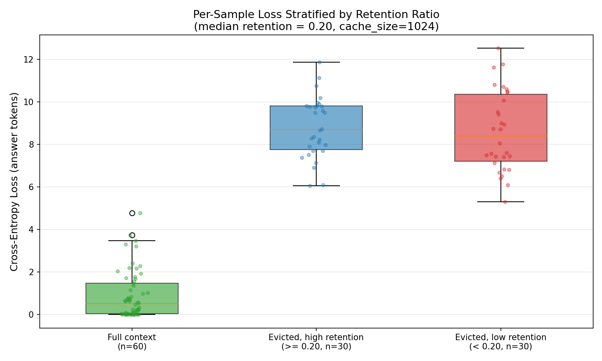
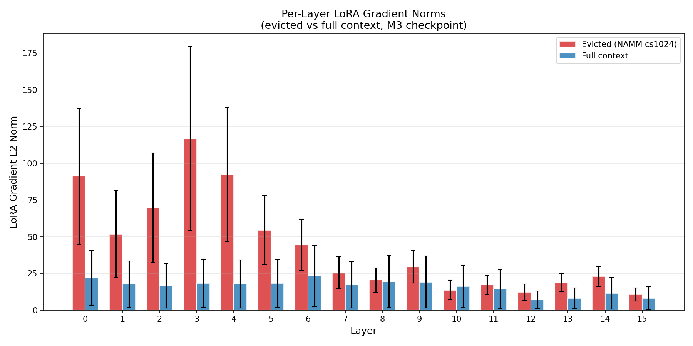
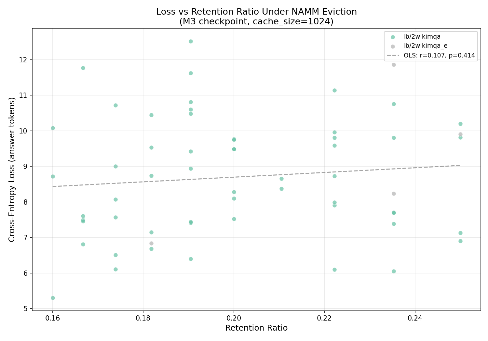
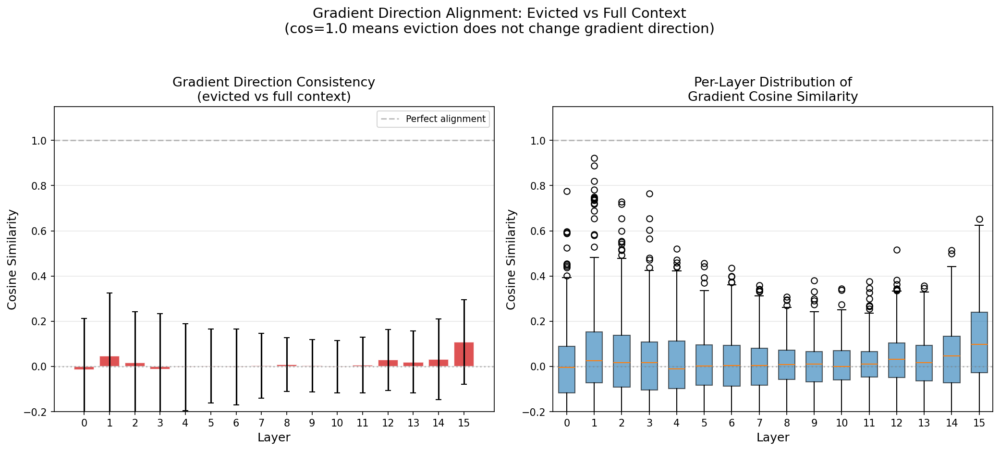

# Analysis 9: Gradient Flow and Loss Attribution Under Eviction

## Overview

This analysis compares gradient flow and per-sample loss between
NAMM-evicted (cache_size=1024) and full-context conditions using
the M3 checkpoint (LoRA + frozen NAMM). We perform instrumented
evaluation passes over training data, computing per-token CE loss
on answer tokens and recording LoRA gradient norms.

## Results Summary

- **Samples processed**: 60 evicted, 60 full context
- **Mean retention ratio**: 0.2014 +/- 0.0270 (median: 0.1952)
- **Evicted loss**: 8.7064 +/- 1.6597
- **Full-context loss**: 0.9023 +/- 1.1133
- **Loss increase from eviction**: 7.8041 (864.9%)
- **Gradient direction consistency**: mean cosine similarity = 0.0151 +/- 0.1813

## Plots

### 1. Loss Stratified by Retention Ratio

Box plot comparing per-sample CE loss across three conditions:
full context, high-retention eviction, and low-retention eviction.

### 2. Per-Layer Gradient Norms

Per-layer LoRA gradient L2 norms under eviction vs full context.
Differences indicate which layers are most affected by eviction.

### 3. Loss vs Retention Ratio

Scatter plot showing the relationship between retention ratio
and CE loss. A negative trend would indicate that more aggressive
eviction increases loss.

### 4. Gradient Direction Consistency

Per-layer cosine similarity between gradient directions computed
under eviction vs full context. Values near 1.0 indicate that
eviction does not substantially alter the gradient signal.

## Interpretation

Gradient directions differ substantially between evicted and full-context conditions (mean cosine similarity < 0.5), suggesting significant gradient signal distortion from eviction.

Eviction increases loss by 864.9%, indicating that some answer-relevant information is lost during cache compression.

